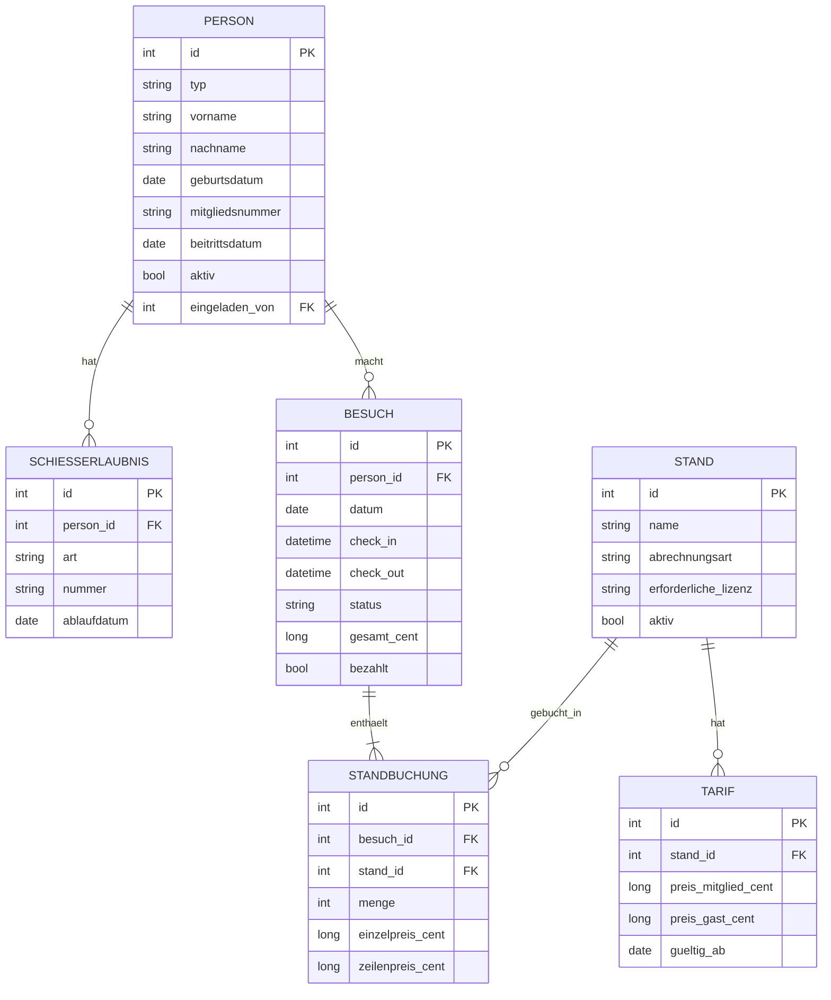

# Jagdschützenclub-Verwaltung — Architektur & Prompt-Plan

**Version:** 0.1 (Entwurf, lebendes Dokument)
**Zweck:** Single Source of Truth für den Coding Agent. Der Agent implementiert *nur* nach diesem Dokument und den daraus abgeleiteten Stage-Prompts — nicht frei.

---

## 1. Überblick & Ziel

Lokale Desktop-Anwendung (ein Rechner am Tresen, ein Bediener, offline) zur Verwaltung des Tagesgeschäfts eines Jagdschützenclubs:

- Mitglieder- und Gästeverwaltung
- An- und Abmeldung (Check-in / Check-out)
- Prüfung der Gültigkeit von Schießerlaubnissen (Jagdschein, Sportschützenschein, WBK, …)
- Zuteilung auf Stände (Skeet, Trap, Kipphase, Kugel, Pistole, Laufender Keiler)
- Preisberechnung (pro Taube bei Skeet/Trap, pauschal beim Rest; Mitgliederrabatt)
- Dauerhafte Aufbewahrung der Daten zur Dokumentation

---

## 2. Technologie-Stack

| Bereich        | Wahl                                             | Begründung |
|----------------|--------------------------------------------------|------------|
| Sprache        | Java 21 (LTS)                                     | Langlebig, wartungsarm, stabil |
| GUI            | JavaFX 21 (`javafx-controls`, `javafx-fxml`)      | Modernes Desktop-Toolkit, `TableView` für Datengitter |
| Datenbank      | SQLite via `org.xerial:sqlite-jdbc`               | Einzelne, portable, sicherbare Datei; SQL-Auswertungen |
| Persistenz     | Schlanke Repository-Schicht auf reinem JDBC       | Kein ORM-Overkill; testbar gegen In-Memory-SQLite |
| Tests          | JUnit 5 + AssertJ                                 | Standard, exzellente Test-Kultur |
| Build          | Maven                                             | Deklarativ, agent-freundlich |
| Verpackung     | `jpackage` (+ `jlink`)                             | Nativer Installer mit gebündeltem JRE |
| Geld           | Integer in **Cent** (`long`)                      | Keine Fließkomma-Rundungsfehler |

Kein Hibernate/JPA (zu schwer für dieses Datenvolumen), keine Web-Runtime.

---

## 3. Architektur (Schichten)

Strikte Trennung von reiner Logik und Präsentation — analog zum Wargame-Prinzip.

```
+-----------------------------------------------------------+
|  ui        JavaFX (FXML-Views + Controller) — dünn         |
+-----------------------------------------------------------+
|  service   Anwendungsfälle: Anmelde-, Kassen-,             |
|            Mitglieder-, StammdatenService                  |
+-----------------------------------------------------------+
|  pricing   PreisRechner   (REIN, keine DB/UI)              |
|  lizenz    LizenzPruefer  (REIN, keine DB/UI)              |
+-----------------------------------------------------------+
|  persistence   Repository-Interfaces + JDBC/SQLite-Impls   |
+-----------------------------------------------------------+
|  domain    Entities, Enums, Value Objects (Betrag)         |
+-----------------------------------------------------------+
```

**Abhängigkeitsregel:** Pfeile zeigen immer nach unten. `domain`, `pricing`, `lizenz` haben **keine** Abhängigkeit zu `persistence` oder `ui`. Die reinen Module (`pricing`, `lizenz`) sind vollständig ohne DB und ohne JavaFX unit-testbar.

### Paketstruktur

```
de.jsc.kasse
├── app          // Main / Bootstrap / DI-Verdrahtung
├── domain       // Entities, Enums, Value Objects
├── pricing      // PreisRechner (rein)
├── lizenz       // LizenzPruefer (rein)
├── persistence  // Repository-Interfaces + jdbc/ Impls + Schema
├── service      // Use-Case-Services
└── ui           // JavaFX Views + Controller
```

> `jsc` = Jagdschützenclub — bei Bedarf umbenennen (z. B. `de.dein-verein.kasse`).

---

## 4. Datenmodell

### 4.1 Enums

```java
enum PersonTyp      { MITGLIED, GAST }
enum LizenzArt      { JAGDSCHEIN, SPORTSCHUETZENSCHEIN, WBK, SONSTIGE }
enum Abrechnungsart { PRO_TAUBE, PAUSCHAL }
enum BesuchStatus   { ANGEMELDET, ABGEMELDET }
enum LizenzBewertung{ GUELTIG, ABGELAUFEN, FEHLT }
```

### 4.2 ER-Diagramm



### 4.3 Schema (DDL-Skizze, SQLite)

```sql
CREATE TABLE person (
  id             INTEGER PRIMARY KEY AUTOINCREMENT,
  typ            TEXT NOT NULL CHECK (typ IN ('MITGLIED','GAST')),
  vorname        TEXT NOT NULL,
  nachname       TEXT NOT NULL,
  geburtsdatum   TEXT,                 -- ISO-8601, nullable
  mitgliedsnummer TEXT UNIQUE,         -- nur bei Mitglied
  beitrittsdatum TEXT,                 -- nur bei Mitglied
  aktiv          INTEGER NOT NULL DEFAULT 1,
  eingeladen_von INTEGER REFERENCES person(id),  -- nur bei Gast, optional
  kontakt        TEXT,
  angelegt_am    TEXT NOT NULL
);

CREATE TABLE schiesserlaubnis (
  id           INTEGER PRIMARY KEY AUTOINCREMENT,
  person_id    INTEGER NOT NULL REFERENCES person(id),
  art          TEXT NOT NULL,          -- LizenzArt
  nummer       TEXT,
  ablaufdatum  TEXT NOT NULL,          -- ISO-8601
  ausgestellt_am TEXT
);

CREATE TABLE stand (
  id                  INTEGER PRIMARY KEY AUTOINCREMENT,
  name                TEXT NOT NULL UNIQUE,
  abrechnungsart      TEXT NOT NULL CHECK (abrechnungsart IN ('PRO_TAUBE','PAUSCHAL')),
  erforderliche_lizenz TEXT,           -- LizenzArt oder NULL (= beliebige gültige)
  aktiv               INTEGER NOT NULL DEFAULT 1
);

CREATE TABLE tarif (
  id                 INTEGER PRIMARY KEY AUTOINCREMENT,
  stand_id           INTEGER NOT NULL REFERENCES stand(id),
  preis_mitglied_cent INTEGER NOT NULL,
  preis_gast_cent    INTEGER NOT NULL,
  gueltig_ab         TEXT NOT NULL     -- ISO-8601, Preishistorie
);

CREATE TABLE besuch (
  id          INTEGER PRIMARY KEY AUTOINCREMENT,
  person_id   INTEGER NOT NULL REFERENCES person(id),
  datum       TEXT NOT NULL,
  check_in    TEXT NOT NULL,
  check_out   TEXT,
  status      TEXT NOT NULL CHECK (status IN ('ANGEMELDET','ABGEMELDET')),
  gesamt_cent INTEGER NOT NULL DEFAULT 0,
  bezahlt     INTEGER NOT NULL DEFAULT 0,
  bezahlt_am  TEXT,
  lizenz_vermerk TEXT           -- NULL = kein Override; Text = Anmeldung trotz ungültiger Lizenz, mit Begründung (ab Stage 4b, Schema v2)
);

CREATE TABLE standbuchung (
  id              INTEGER PRIMARY KEY AUTOINCREMENT,
  besuch_id       INTEGER NOT NULL REFERENCES besuch(id),
  stand_id        INTEGER NOT NULL REFERENCES stand(id),
  menge           INTEGER NOT NULL,          -- Tauben (PRO_TAUBE) oder Durchgänge (PAUSCHAL)
  einzelpreis_cent INTEGER NOT NULL,         -- Snapshot!
  zeilenpreis_cent INTEGER NOT NULL          -- menge * einzelpreis
);

CREATE TABLE schema_version ( version INTEGER NOT NULL );
```

**Seed-Daten Stände:**

| name             | abrechnungsart |
|------------------|----------------|
| Skeet            | PRO_TAUBE      |
| Trap             | PRO_TAUBE      |
| Kipphase         | PAUSCHAL       |
| Kugel            | PAUSCHAL       |
| Pistole          | PAUSCHAL       |
| Laufender Keiler | PAUSCHAL       |

### 4.4 Snapshot-Prinzip (wichtig für Doku)

`besuch.gesamt_cent`, `standbuchung.einzelpreis_cent` und `zeilenpreis_cent` werden **zum Zeitpunkt der Buchung eingefroren**. Spätere Tarifänderungen verändern historische Belege dadurch nicht. `besuch`- und `standbuchung`-Datensätze werden **niemals hart gelöscht**.

---

## 5. Kernkomponenten (rein, testbar)

### 5.1 Preis-Engine

```java
// Eingabe pro Position — enthält bereits die aufgelösten Tarife,
// damit die Engine KEINE DB braucht.
record PositionsWunsch(long standId, Abrechnungsart art, int menge,
                       long preisMitgliedCent, long preisGastCent) {}

record Preiszeile(long standId, int menge, long einzelpreisCent, long zeilenpreisCent) {}
record Preisaufstellung(List<Preiszeile> zeilen, long gesamtCent) {}

public final class PreisRechner {
    public Preisaufstellung berechne(boolean istMitglied, List<PositionsWunsch> positionen) {
        // je Position:
        //   einzelpreis = istMitglied ? preisMitgliedCent : preisGastCent
        //
        //   PRO_TAUBE (Skeet, Trap):
        //     zeilenpreis     = einzelpreis * menge
        //     Preiszeile.menge = eingegebene menge
        //
        //   PAUSCHAL (Kipphase, Kugel, Pistole, Laufender Keiler):
        //     Tagespreis JE STAND, unabhaengig von der Anzahl Durchgaenge.
        //     zeilenpreis     = einzelpreis      // menge fliesst NICHT ein
        //     Preiszeile.menge = 1               // fuer saubere Belegzeile
        //
        // gesamt = Summe aller zeilenpreis
        // Reihenfolge der Zeilen = Reihenfolge der Eingabe
        // Keine Rundung (ganzzahlige Cent).
        // Validierung: menge >= 1, preise >= 0, sonst IllegalArgumentException.
    }
}
```

Die `service`-Schicht löst die gültigen Tarife aus der DB auf und füttert sie in die Engine. Die Engine selbst ist eine reine Funktion → triviale Unit-Tests.

**Kernregel (bestätigt):** `PRO_TAUBE` rechnet mengenabhängig, `PAUSCHAL` ist ein Tagespreis **je Stand** (mehrere Durchgänge am selben Stand kosten gleich viel; zwei verschiedene Pauschal-Stände kosten je ihre eigene Tagespauschale). Der Sonderfall „dieselbe Person meldet sich am selben Tag mehrfach an" wird nicht hier, sondern in der Service-Schicht behandelt.

**Abgestimmte Testfälle (Stage 2):**

| Nr | Szenario | Eingabe (istMitglied · Stand/art/menge/preisM/preisG ct) | Erwartung (ct) |
|----|----------|-----------------------------------------------------------|----------------|
| T1 | Leere Liste | `true` · [] | gesamt=0 |
| T2 | Mitglied, pro Taube | `true` · [Skeet/PRO_TAUBE/25/12/15] | einzel=12, zeilen=300 · gesamt=300 |
| T3 | Gast, pro Taube | `false` · [Skeet/PRO_TAUBE/25/12/15] | einzel=15, zeilen=375 · gesamt=375 |
| T4 | Mitglied, pauschal | `true` · [Kugel/PAUSCHAL/1/500/700] | menge→1, zeilen=500 · gesamt=500 |
| T5 | Pauschal, menge egal | `true` · [Kugel/PAUSCHAL/3/500/700] | menge→1, zeilen=500 · gesamt=500 |
| T6 | Pauschal, Gast | `false` · [Kugel/PAUSCHAL/3/500/700] | einzel=700, zeilen=700 · gesamt=700 |
| T7 | Gemischt, Mitglied | `true` · [Skeet/PRO_TAUBE/25/12/15] + [Trap/PRO_TAUBE/50/10/13] + [Kugel/PAUSCHAL/2/500/700] | 300+500+500 · gesamt=1300 |
| T8 | Gemischt, Gast | `false` · (wie T7) | 375+650+700 · gesamt=1725 |
| T9 | Zwei Pauschal-Stände | `true` · [Kugel/PAUSCHAL/1/500/700] + [Pistole/PAUSCHAL/1/400/600] | 500+400 · gesamt=900 |
| T10 | Menge < 1 | `true` · [Skeet/PRO_TAUBE/0/12/15] | `IllegalArgumentException` |
| T11 | Negativer Preis | `true` · [Skeet/PRO_TAUBE/25/-1/15] | `IllegalArgumentException` |

### 5.2 Lizenz-Prüfer

```java
record LizenzStatus(LizenzBewertung bewertung, LocalDate ablaufdatum,
                    long tageBisAblauf, boolean warnung) {}

public final class LizenzPruefer {
    // Prüft, ob für die erforderliche Lizenzart eine gültige Erlaubnis vorliegt.
    // erforderlich == null  → jede gültige Erlaubnis genügt.
    public LizenzStatus pruefe(List<Schiesserlaubnis> lizenzen,
                               LizenzArt erforderlich, LocalDate stichtag) {
        // Relevante Erlaubnisse:
        //   erforderlich == null -> alle; sonst nur die dieser Art.
        // Bewertung:
        //   keine relevante        -> FEHLT
        //   alle relevanten abgelaufen -> ABGELAUFEN
        //   mind. eine gueltige    -> GUELTIG
        // Gueltig, wenn stichtag <= ablaufdatum (Ablauftag zaehlt noch).
        // ablaufdatum: GUELTIG -> spaetestes unter den gueltigen;
        //              ABGELAUFEN -> spaetestes unter den relevanten;
        //              FEHLT -> null.
        // tageBisAblauf: ChronoUnit.DAYS(stichtag -> ablaufdatum),
        //                negativ wenn abgelaufen, bei FEHLT 0.
        // warnung = (bewertung == GUELTIG)
        //           && (ablaufdatum.getYear() == stichtag.getYear());
    }
}
```

Auch rein. Der Service reagiert auf `ABGELAUFEN`/`FEHLT` mit Warnung + Aufforderung, ein neues Datum einzutragen.

**Warnregel (bestätigt):** `warnung` wird `true`, sobald das Kalenderjahr beginnt, in dem die maßgebliche Erlaubnis abläuft — also bei Gültigkeit bis 31.03.2026 ab dem 01.01.2026. Sie ist orthogonal zur `bewertung`: eine Erlaubnis kann `GUELTIG` **und** zu warnen sein. Ab dem tatsächlichen Ablauf ist der Status `ABGELAUFEN` (keine Warnung mehr).

**Abgestimmte Testfälle (Stage 3)** — Stichtag 15.06.2026, außer wo angegeben; `tageBisAblauf` exakt nur wo eindeutig, sonst Vorzeichen:

| Nr | Szenario | Eingabe (erforderlich · Art/Ablauf) | bewertung | ablauf | tage | warnung |
|----|----------|--------------------------------------|-----------|--------|------|---------|
| L1 | Keine Erlaubnis | `null` · [] | FEHLT | null | 0 | false |
| L2 | Gültig, Folgejahr | `null` · [JAGDSCHEIN/31.03.2027] | GUELTIG | 31.03.2027 | >0 | false |
| L3 | Ablauf heute | `null` · [JAGDSCHEIN/15.06.2026] | GUELTIG | 15.06.2026 | 0 | true |
| L4 | Gestern abgelaufen | `null` · [JAGDSCHEIN/14.06.2026] | ABGELAUFEN | 14.06.2026 | -1 | false |
| L5 | Zwei gleiche Art, eine gültig | `null` · [JAGDSCHEIN/14.06.2026]+[JAGDSCHEIN/31.03.2027] | GUELTIG | 31.03.2027 | >0 | false |
| L6 | Alle abgelaufen | `null` · [JAGDSCHEIN/01.01.2026]+[SPORTSCHUETZENSCHEIN/14.06.2026] | ABGELAUFEN | 14.06.2026 | -1 | false |
| L7 | Bald fällig | `null` · [WBK/25.06.2026] | GUELTIG | 25.06.2026 | 10 | true |
| L8 | Versch. Arten, spätere gültig | `null` · [JAGDSCHEIN/01.01.2026]+[WBK/31.12.2026] | GUELTIG | 31.12.2026 | >0 | true |
| L9 | Vor Jahreswechsel — kein Warnen | *Stichtag 31.12.2025* · [JAGDSCHEIN/31.03.2026] | GUELTIG | 31.03.2026 | >0 | false |
| L10 | Ab Jahresbeginn — Warnung | *Stichtag 01.01.2026* · [JAGDSCHEIN/31.03.2026] | GUELTIG | 31.03.2026 | >0 | true |
| L11 | *(künftig)* geforderte Art gültig | `JAGDSCHEIN` · [JAGDSCHEIN/31.03.2027] | GUELTIG | 31.03.2027 | >0 | false |
| L12 | *(künftig)* geforderte Art fehlt | `JAGDSCHEIN` · [WBK/31.12.2026] | FEHLT | null | 0 | false |

---

## 6. Offene Design-Entscheidungen

> Diese Punkte blockieren Stages 2–4. Defaults sind gesetzt, damit Stage 0/1 sofort startbar sind.

1. **Rabattmodell** — *Bestätigt:* getrennte `preis_mitglied` / `preis_gast` pro Stand (kein globaler Prozentsatz).
2. **Lizenz → Stand** — *Bestätigt:* vorerst alle Erlaubnisse gleich behandelt, jede gültige genügt (`erforderliche_lizenz` bleibt NULL, `LizenzPruefer` mit `erforderlich = null`). Spätere Verschärfung ohne Schema-/Engine-Änderung möglich.
3. **Abgelaufene Lizenz** — *Bestätigt:* Warnung + Pflicht zu neuem Datum ODER Override-mit-Vermerk (`besuch.lizenz_vermerk`) vor Anmeldung. Zusätzlich Vorwarnung `warnung` ab Beginn des Ablaufjahres (siehe 5.2). Ablauftag zählt noch als gültig.
4. **Zahlzeitpunkt / Ablauf** — *Bestätigt, zweiphasig:* Beim **Check-in** nur Standzuteilung, ohne Mengen und ohne Preis (provisorische Standbuchungen). Die Taubenzahl je Stand wird erst beim **Check-out** genannt; **dort** werden Tarife aufgelöst, die Preis-Engine läuft und die Beträge werden eingefroren (`gesamt_cent`, Standbuchungs-Snapshots). Abmelden und Kassieren sind eine Aktion. Tarif-Stichtag = `besuch.datum`. Skeet/Trap mit 0 Tauben fallen aus der Rechnung; Pauschal-Stände zählen wie zugeteilt.
5. **Preise editierbar** — Ja, Tarif-Pflege im UI (Kassenwart), Historie via `gueltig_ab`.

**Betriebsregel:** Pro Person maximal ein offener Besuch (`ANGEMELDET`); erneute Anmeldung erst nach Abmeldung möglich.

---

## 7. Test-Strategie

- `pricing`, `lizenz`: reine Unit-Tests, keine Infrastruktur. Testfälle werden **vor** der Implementierung fachlich abgesegnet.
- `persistence`: Tests gegen In-Memory-SQLite (`jdbc:sqlite::memory:`), Schema pro Test frisch aufgesetzt.
- `service`: gegen In-Memory-DB oder Fake-Repositories.
- Zielvorgabe: `mvn clean test` grün als Voraussetzung für jeden Stage-Abschluss.

---

## 8. Staged Prompt-Plan

| Stage | Inhalt | Status |
|-------|--------|--------|
| **0** | Projekt-Setup: Maven, Java 21, JavaFX, SQLite, JUnit, Paketstruktur, startbares Fenster | ✅ fertig |
| **1** | Domäne + Persistenz: Entities, Enums, Repository-Interfaces + JDBC-Impls, Schema, Seed, Tests | ✅ fertig |
| **2** | Preis-Engine (rein, Testfälle T1–T11) | ✅ fertig |
| **3** | Lizenz-Prüfer (rein, Testfälle L1–L12) | ✅ fertig |
| **4a** | MitgliederService + StammdatenService (Datenpflege, Tarif-Auflösung) | ✅ fertig |
| **4b** | AnmeldeService + KassenService (zweiphasiger Ablauf, Snapshot, Override; Schema v2 `lizenz_vermerk`) | ✅ fertig |
| **5a** | App-Shell + Navigation + Mitgliederverwaltung (Tabelle links, Details/Lizenzen rechts) | ✅ fertig |
| **5b** | Stammdaten/Tarife (Stände, Preise, Tarifhistorie) | bereit (nächster Schritt) |
| **5c** | Tresen: Check-in als **Dialog** (Suche, Lizenz-Check/Override, Standzuteilung) + Übersicht offener Besuche | geplant (nach 5b) |
| **5d** | Tresen: Check-out als **Dialog** (Tauben erfassen, Summe läuft live mit, abmelden+kassieren) | geplant (nach 5c) |
| **6** | Tagesabschluss / Doku-Export (optional Belegdruck) | geplant |
| **7** | Packaging: `jpackage`-Installer | geplant |

Jeder Stage-Prompt folgt derselben Vorlage (Abschnitt 9). Stage 0 + 1 sind unten fertig ausformuliert.

---

## 9. Prompt-Vorlage

```
KONTEXT
- Projekt: Jagdschützenclub-Verwaltung (Java 21, JavaFX, SQLite).
- Verbindliche Grundlage: ARCHITEKTUR.md (dieses Dokument). Nicht davon abweichen.
- Sprache im Code: englische Bezeichner nur wo üblich; Domänenbegriffe deutsch
  (Mitglied, Besuch, Stand, Tarif, Schiesserlaubnis).

ZIEL DIESER STAGE
- <ein Satz>

SCOPE (bauen)
- <konkrete Liste>

AUSSERHALB DES SCOPE (nicht anfassen)
- <klare Grenzen>

AKZEPTANZKRITERIEN
- <prüfbar, inkl. "mvn clean test" grün>

KONVENTIONEN
- Paketwurzel de.jsc.kasse. Geld als long Cent. Reine Module ohne DB/UI-Import.
```

---

## 10. Stage 0 — Projekt-Setup (fertiger Prompt)

```
KONTEXT
Projekt: Jagdschützenclub-Verwaltung. Verbindliche Grundlage ist ARCHITEKTUR.md.
Lokale Java-Desktop-Anwendung, Java 21, JavaFX 21, SQLite, Maven, JUnit 5 + AssertJ.

ZIEL
Lauffähiges, leeres Projektgerüst mit korrekter Paketstruktur und einem startbaren
JavaFX-Fenster.

SCOPE
- Maven-Projekt (pom.xml) für Java 21.
- Abhängigkeiten: javafx-controls, javafx-fxml (Version 21), org.xerial:sqlite-jdbc,
  JUnit 5, AssertJ. javafx-maven-plugin für "mvn javafx:run".
- Paketstruktur exakt nach ARCHITEKTUR.md Abschnitt 3.3 anlegen (leere, aber
  vorhandene Pakete): app, domain, pricing, lizenz, persistence, service, ui.
- Klasse de.jsc.kasse.app.App als JavaFX-Application, die ein Fenster mit Titel
  "Jagdschützenclub-Verwaltung" und einem Platzhalter-Label öffnet.
- Ein Smoke-Test (JUnit), der nur bestätigt, dass die Testinfrastruktur läuft.
- README.md mit Start-Anleitung (mvn javafx:run) und Build-Anleitung.

AUSSERHALB DES SCOPE
- Keine Datenbank-Logik, keine Entities, keine Geschäftslogik, keine echten Views.

AKZEPTANZKRITERIEN
- "mvn clean test" läuft grün durch.
- "mvn javafx:run" öffnet das Fenster.
- Paketstruktur entspricht ARCHITEKTUR.md.

KONVENTIONEN
- Paketwurzel de.jsc.kasse. Java 21 Sprachfeatures erlaubt (records, switch).
```

---

## 11. Stage 1 — Domäne + Persistenz (fertiger Prompt)

```
KONTEXT
Projekt: Jagdschützenclub-Verwaltung. Verbindliche Grundlage ist ARCHITEKTUR.md,
insbesondere Abschnitt 4 (Datenmodell, Enums, DDL, Seed-Daten).
Baut auf dem Ergebnis von Stage 0 auf.

ZIEL
Vollständige Domänenschicht und Persistenzschicht (SQLite) mit Tests. Noch keine UI,
keine Preis- oder Lizenzlogik.

SCOPE
1. domain: Enums (PersonTyp, LizenzArt, Abrechnungsart, BesuchStatus) und Entities
   als Java-records/Klassen: Person, Schiesserlaubnis, Stand, Tarif, Besuch,
   Standbuchung — Felder exakt nach ARCHITEKTUR.md 4.3. Geldfelder als long (Cent),
   Datumsfelder als LocalDate/LocalDateTime.
2. persistence: Schema-Initialisierung aus einer schema.sql (Ressource), ausgeführt
   beim Start gegen eine SQLite-Datei; Versionierung über die Tabelle schema_version.
   Seed der sechs Stände (ARCHITEKTUR.md 4.3) beim Erststart.
3. persistence: Repository-Interfaces + JDBC-Implementierungen für:
   PersonRepository, SchiesserlaubnisRepository, StandRepository, TarifRepository,
   BesuchRepository, StandbuchungRepository. CRUD nach Bedarf; Personen und Besuche
   werden nie hart gelöscht (nur deaktiviert bzw. behalten).
4. Eine kleine Datasource-/Connection-Verwaltung (Dateipfad konfigurierbar,
   In-Memory für Tests via "jdbc:sqlite::memory:").

AUSSERHALB DES SCOPE
- Keine Preisberechnung (kommt in Stage 2).
- Keine Lizenzprüfung (kommt in Stage 3).
- Keine Services, keine UI.

AKZEPTANZKRITERIEN
- Für jedes Repository Integrationstests gegen In-Memory-SQLite: Anlegen, Lesen,
  Aktualisieren; Seed der Stände wird geprüft.
- Fremdschlüssel und CHECK-Constraints greifen (Testfall mit ungültigem typ schlägt fehl).
- Snapshot-Felder (einzelpreis_cent, zeilenpreis_cent, gesamt_cent) sind vorhanden und
  werden korrekt persistiert.
- "mvn clean test" grün.

KONVENTIONEN
- Paketwurzel de.jsc.kasse. domain hat KEINE Imports aus persistence/ui.
- Geld als long Cent. Datumswerte ISO-8601 in der DB.
```

---

## 12. Nächste Schritte

1. Offene Punkte aus Abschnitt 6 entscheiden.
2. Stage 0 an den Agent geben, Ergebnis reviewen.
3. Stage 1 an den Agent geben.
4. Danach Stages 2–4 (Preis, Lizenz, Services) auf Basis der getroffenen Entscheidungen ausformulieren.